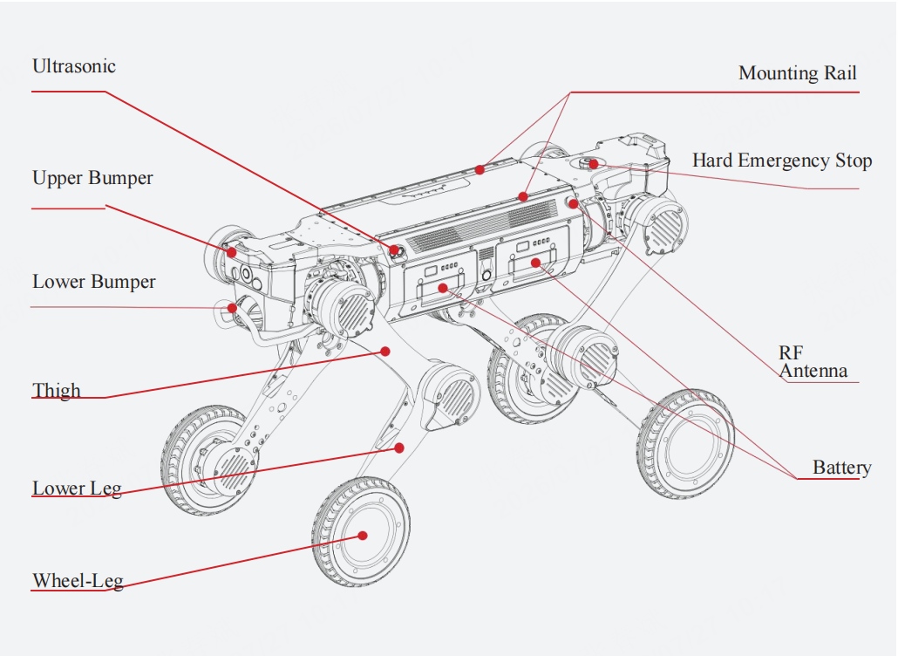
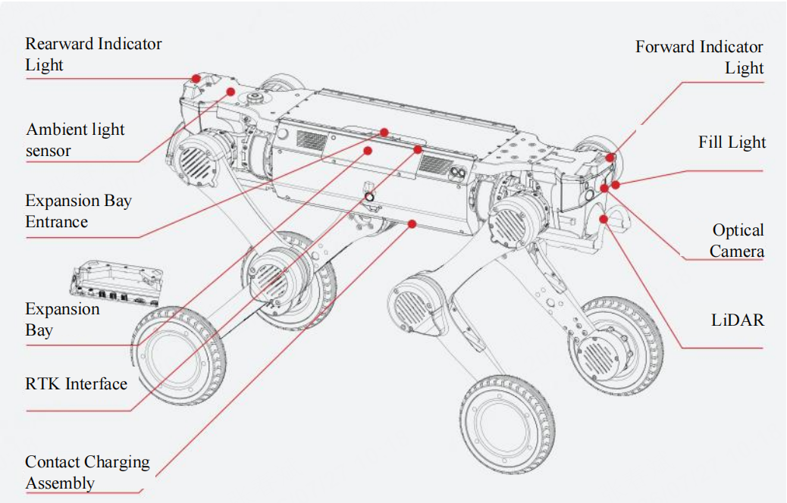

1.3 Product Specifications
============

| Category | Specification | Description |
|-------------|----------------------|-------------------------|
| Basic Information | Standing Dimensions | 930mm * 480mm * 585mm |
|             | Prone Dimensions | 930mm * 630mm * 200mm |
|             | Total Weight (including battery)  | 41kg |
|             | Operating Temperature   | -20°~55° |
|             | Ingress Protection Rating   | IP67 |
|             | Battery Module | 504.9Wh * 2, dual batteries, supports quick‑release/quick-swap and hot‑swapping |
|             | Charging Time   | <1.5h |
|             | Battery Life   | Unloaded: 5 ± 0.5h; Full load: 3.5 ± 0.5h |
| Performance Parameters | Maximum Speed   | 6m/s |
|             | Rated Stable Payload   | 25kg |
|             | Continuous Step‑Climbing Height | 25cm |
|             | Maximum Obstacle Clearance Height | 80cm |
|             | Maximum Gap Crossing Width | 80cm |
|             | Payload Crossing Height   | 50cm |
|             | Minimum Passage Width    | 50cm |
|             | Maximum Climbing Angle    | 45°  |
|             | Minimum Turning Width    | Supports in‑place turning and forward/backward direction switching |
|             | Main Control Compute | 157 Tops/Nvidia Orin NX 16GB |
| Sensing Units | LiDAR | One 96‑channel LiDAR (Airy 96‑channel) each front and rear, 360° × 90° coverage, 120m detection range |
|           | Wide-Angle Camera | FPV Camera Configuration: Front x1, Rear x1, industrial-grade 8 MP, Field of view: DFOV 122°, HFOV 111°, VFOV 70° |
|            | Fill Light | Fill light * 4, 2 on each side, paired with the FPV camera. Illumination distance ≥ 3m |
|            | IMU | Automotive-grade IMU * 1 |
|            | Ultrasonic Sensor | One ultrasonic sensor each on the left and right sides; supports obstacle detection within 5m |
|            | RTK Module | GNSS RTK * 1 |
|            | Microphone & Speaker | Supported on select versions |
|            | Ambient Light Sensor | Supported on select versions |
| Function List | Locomotion Performance | Supports stepping, gliding, and crawling gaits; capable of straight-line movement forward/backward/left/right, in‑place rotation, etc; supports knee-joint posture transitions. Operates on various terrains such as gravel, asphalt, grass, sandy soil, forest floor, and rubble; |
|            | Wheel/Foot Quick‑Swap | Supports quick‑swapping between wheeled-leg and point‑foot modes |
|            | Real-Time Image Transmission | Supported |
|            | OTA Upgrades | Supported |
|            | Secondary Development | Supported; provides SDK development packages; robot model includes 3D CAD and URDF files for simulation |
|            | Power Output Interfaces | 5V, 12V, 24V, 48V; maximum output power 480W |
|            | Communication Interface | Gigabit Ethernet port * 2, USB 3.0 * 2, Serial port * 1 |
| Communication | Wi-Fi | Supported|
|            | Bluetooth | Supported |
|            | RF Communication | Supported |
| Accessories | Adapter Charging Dock | Standard |
|            | Remote Controller with Integrated Display | Standard; control range 700-1000m |
|            | Autonomous Charging Dock | Optional |
|            | Aviation‑Grade Shipping Case | Standard |
| Other        | Warranty Period | 1 year |

**Note: The above parameters are laboratory test data. Actual performance may vary depending on factors such as the operating environment and usage methods; please refer to the actual product performance.**

-  Joint Parameters

| Part | Parameters | Value |
|-------------|----------------------|-------------------------|
| Hip Roll | Max Torque | 150N.m |
|             | Max Speed | 190RPM |
|             | Weight | 0.93kg |
|             | Joint Limits | -39.9°~30° |
| Hip Pitch | Max Torque | 150N.m |
|             | Max Speed | 190RPM |
|             | Weight | 0.93kg |
|             | Joint Limits | -140°~140° |
| Knee Pitch | Max Torque | 150N.m |
|             | Max Speed | 190RPM |
|             | Weight | 0.93kg |
|             | Joint Limits | -160°~160° |
| Foot | Max Torque | 33N.m |
|             | Max Speed | 1200RPM |
|             | Weight | 1.275kg |
|             | Radius | 9cm |
|             | Joint Limits | -180°~180° |