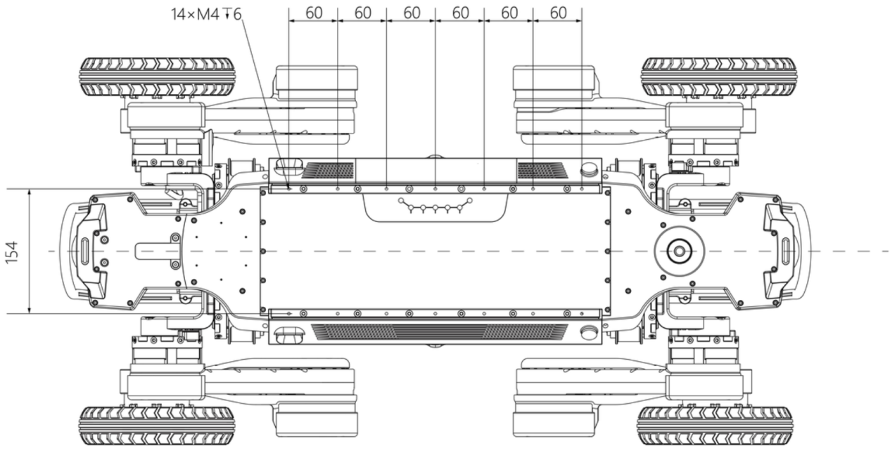

1.4 Rear-Mount Payload Installation
============

1.4.1 Payload Mounting Hole Layout
-------------------------

The robot's back provides a flat, level surface with a payload capacity of 25–30kg. Two guide rails are deployed on the back, each fitted with 14 M4-threaded mounting holes to allow convenient installation of top‑mounted payloads. The specific dimensions of the dual guide rails are as follows:

- **Once a payload is installed on the robot, only basic locomotion mode is supported. Do not use the high‑platform mode once a payload is mounted** 
- **Mounting a payload on the robot's back may affect its locomotion performance. Please consult after‑sales support personnel before installing any payload**

1.4.2 Center‑of‑Gravity Constraints
-------------------------

To prevent collision or interference between the legs and a top‑mounted payload while traversing various terrains, the D1 Max provides the following recommended payload mounting envelope after payload installation: 40 cm (L) × 22 cm (W) × 24 cm (H). The mounting space is centered on the robot's back, as shown in the figure below:

