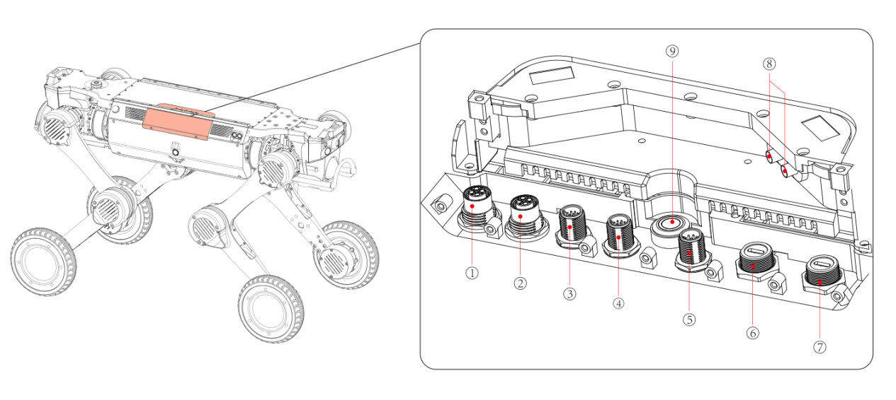
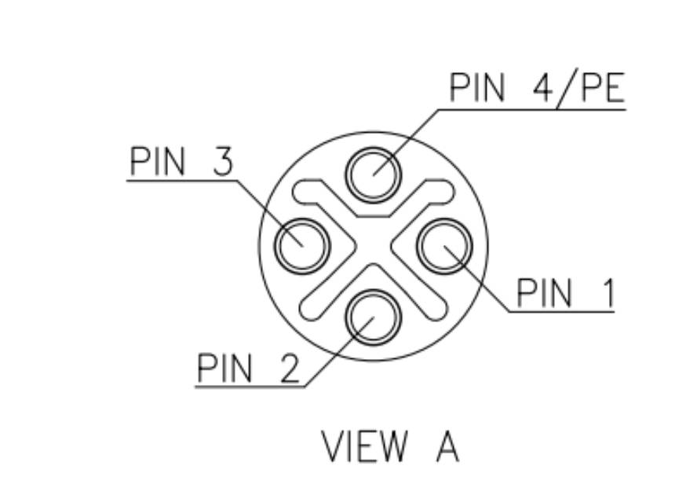
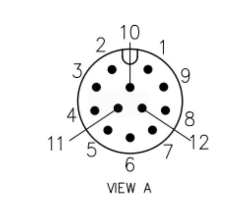
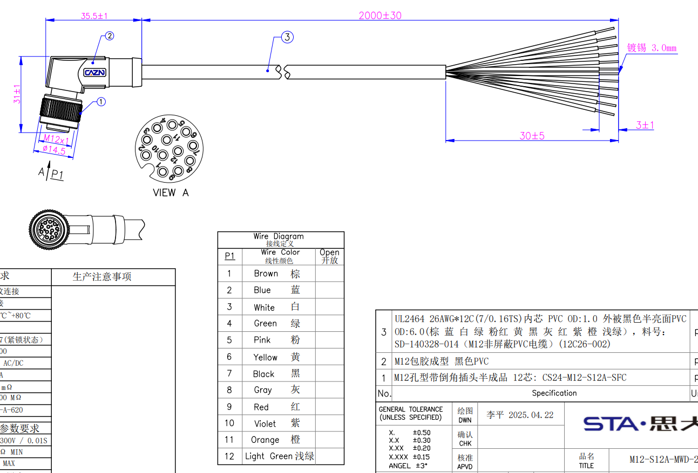
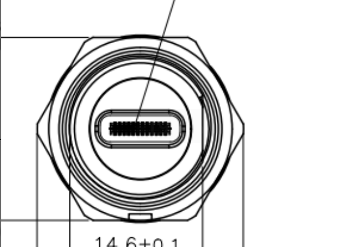

1.5 Electrical Expansion Interfaces
============

| No. | Interface Name |
|------|----------|
| 1 | 48V(10A)  |
| 2 | 24V(20A)  |
| 3 | 24V(3A) + Ethernet Port |
| 4 | 12V(5A) + Ethernet Port |
| 5 | Serial Port(RS232 * 1, RS485 * 1, SBUS * 2, PPS * 1) |
| 6、7 | USB3.0（5V、1A） |
| 8 | RTK Antenna Interface |
| 9 | Expansion Bay Button |

- The combined power output of all power interfaces shall not exceed 480W;
- All aviation connectors are equipped with protective caps to achieve IP67 rating. Ensure that protective caps are properly fitted on any unused aviation connectors;
- The expansion bay button controls power delivery to the expansion interfaces. Before connecting any payload wiring, be sure to turn off the expansion bay power supply.

**Aviation Connector Expansion Function Interface Description:**

| Device Name | Device Path |
|---------|----------|
| RS232 | /dev/ttyCH9344USB4 |
| RS485 | /dev/ttyCH9344USB5 |
| SBUS1 | /dev/ttyCH9344USB2 |
| SBUS2 | /dev/ttyCH9344USB3 |

1.5.1 Power Port – 48V(10A)
------------------------

- Female Aviation Connector

| Connector Name | 48V 10A |
|---------|----------|
| Board‑End Connector Model | M12-S4S-GPFM16-135-CS24044 |
| Pin Assignment 1(Brown) | GND |
| Pin Assignment 2(Red) | 48V |
| Pin Assignment 3(Blue) | 48V |
| Pin Assignment 4(Yellow-Green) | GND |

- Mating Cable Harness

1.5.2 Power Port – 24V(20A)
------------------------

- Female Aviation Connector

| Connector Name | 24V 20A |
|---------|----------|
| Board‑End Connector Model | M12-S4S-GPFM16-135-CS24044 |
| Pin Assignment 1(Brown) | GND |
| Pin Assignment 2(Red) | 24V |
| Pin Assignment 3(Blue) | 24V |
| Pin Assignment 4(Yellow-Green) | GND |

- Mating Cable Harness

1.5.3 Ethernet Port(24V)
------------------------

- Female Aviation Connector

| Connector Name | Ethernet + 24V |
|---------|----------|
| Board‑End Connector Model | M12-P12A-GPFM12 |
| Pin Assignment 1(Brown) | GND |
| Pin Assignment 2(Blue) | 24V |
| Pin Assignment 3(White) | 24V |
| Pin Assignment 4(Green) | Ethernet A+ |
| Pin Assignment 5(Pink) | Ethernet A- |
| Pin Assignment 6(Yellow) | Ethernet B+ |
| Pin Assignment 7(Black) | Ethernet B- |
| Pin Assignment 8(Gray) | Ethernet C+ |
| Pin Assignment 9(Red) | Ethernet C- |
| Pin Assignment 10(Purple) | GND |
| Pin Assignment 11(Orange) | Ethernet D+ |
| Pin Assignment 12(Light Green) | Ethernet D- |

- Mating Cable Harness

1.5.4 Ethernet Port(12V)
------------------------

- Female Aviation Connector

| Connector Name | Ethernet +12V |
|---------|----------|
| Board‑End Connector Model | M12-P12A-GPFM12 |
| Pin Assignment 1(Brown) | GND |
| Pin Assignment 2(Blue) | 12V |
| Pin Assignment 3(White) | 12V |
| Pin Assignment 4(Green) | Ethernet A+ |
| Pin Assignment 5(Pink) | Ethernet A- |
| Pin Assignment 6(Yellow) | Ethernet B+ |
| Pin Assignment 7(Black) | Ethernet B- |
| Pin Assignment 8(Gray) | Ethernet C+ |
| Pin Assignment 9(Red) | Ethernet C- |
| Pin Assignment 10(Purple) | GND |
| Pin Assignment 11(Orange) | Ethernet D+ |
| Pin Assignment 12(Light Green) | Ethernet D- |

- Mating Cable Harness

1.5.5 Serial Port
------------------------

- Female Aviation Connector

| Connector Name | Serial Port (RS232, RS485, SBUS * 2, PPS) |
|---------|----------|
| Board‑End Connector Model | M12-P8A-GPFM12 |
| Pin Assignment 1(White) | PPS |
| Pin Assignment 2(Brown) | SBUS1 |
| Pin Assignment 3(Green) | SBUS2 |
| Pin Assignment 4(Yellow) | RS485A |
| Pin Assignment 5(Gray) | RS485B |
| Pin Assignment 6(Pink) | RS232_TX |
| Pin Assignment 7(Blue) | RS232_RX |
| Pin Assignment 8(Red) | GND |

- Mating Cable Harness

1.5.6 USB Port
------------------------

- Female Aviation Connector

| Connector Name | USB 3.0 + 5V (* 2) |
|---------|----------|
| Board‑End Connector Model | E10B-FT3-PPF |
| Pin Assignment | None |

- Mating Cable Harness

