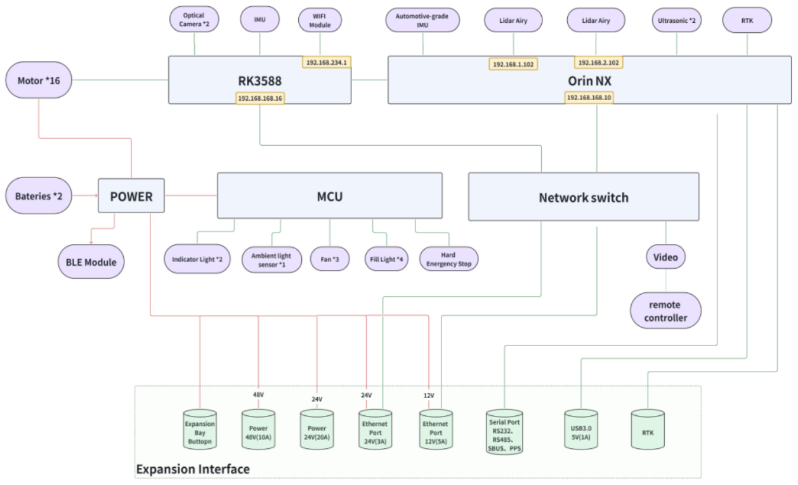

1.6 D1 Max Hardware Architecture Diagram
============

- **Note: The main control board is an RK3588, dedicated to quadruped motion control. Development or deployment on this board is not supported.**
- **The compute board is an Orin NX, dedicated to perception and control of the quadruped robot. Development and deployment may be performed on this compute board. Ensure proper backup management, as flashing or Over-The-Air (OTA) upgrades may overwrite the system.**