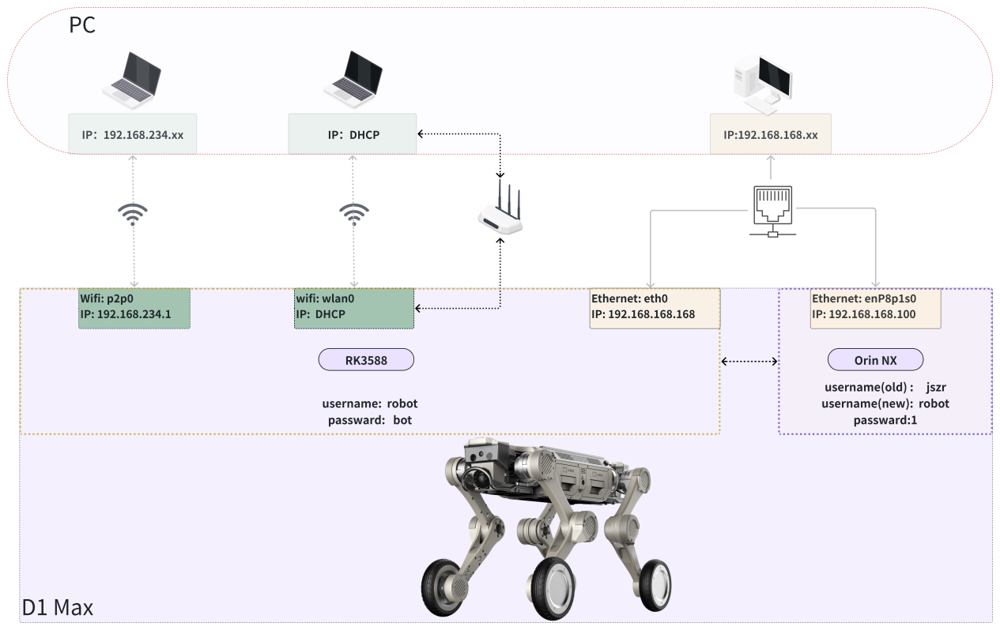

2.5 Device Login
===================

**Network Connection**
- Wi‑Fi Connection
    * Wi‑Fi Name：XG2WIFI_xxxxxx
    * Wi‑Fi Password：12345678
- Wired Connection
    * Use an Ethernet cable to connect the robot's expansion Ethernet port to the control PC
    * Set the control PC's Ethernet IP to 192.168.168.x (cannot be set to 192.168.168.168 or 192.168.168.100)



**SSH Login**

```
#Connect via Wi-Fi
ssh robot@192.168.234.1       #RK3588，password: bot

#Connect via Ethernet cable
ssh robot@192.168.168.168     #RK3588, password: bot
ssh robot@192.168.168.100     #Orin NX,password: 1
```