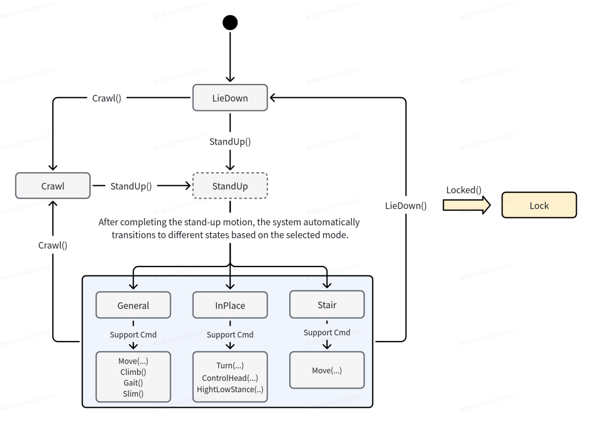
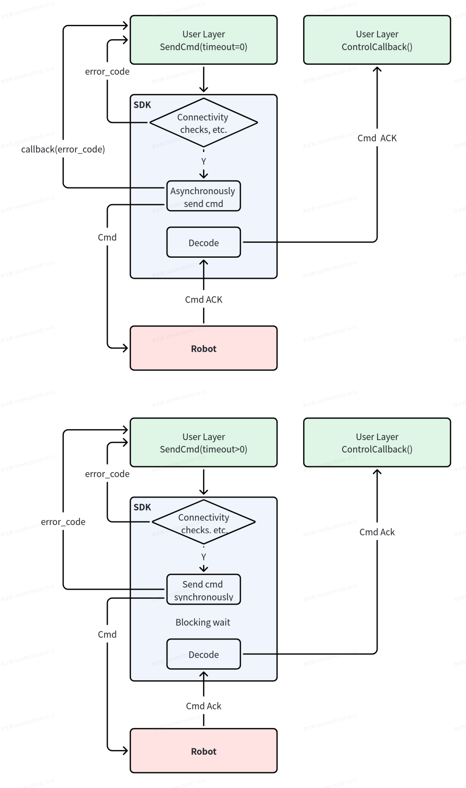

2.8 SDK Control Instructions
=====================

- **SDK commands must be issued following the state transition logic illustrated below. Failure to do so may result in abnormal conditions such as the robot falling over, malfunctioning, or becoming unresponsive.**

**Notes:** 
1.When a "Stand" command is issued, upon completion of the standing motion, the robot will automatically transition to the general state or the in‑place state depending on the current mode 
2.Switching from the locked state to any other state will release the lock

- **The SDK command issuance workflow is as follows**

