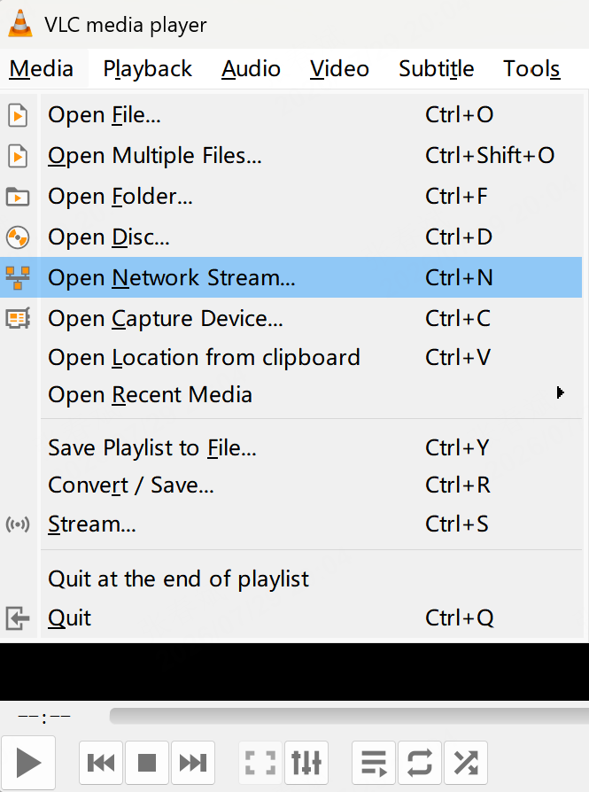
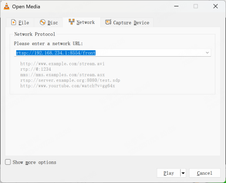
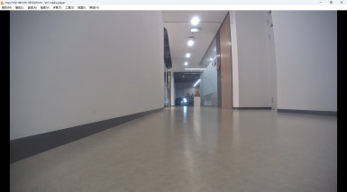

4.1 Video Stream Data
====================

Video streams from the front and rear wide‑angle cameras are pushed via GStreamer to the following URLs:
```
Front Camera: rtsp://192.168.234.1:8554/front
Rear Camera: rtsp://192.168.234.1:8554/back
```
By default, the live video feed is pulled and displayed on the remote-controller. The streams can also be previewed and accessed using VLC or ffplay. Examples:<br>
- **case1:On a Windows PC connected to the robot's Wi‑Fi, use VLC to view the video stream:**
    * step1:Open VLC, click "Media → Open Network Stream"
    
    * step2:Enter the stream URL, e.g.,
    `rtsp://192.168.234.1:8554/front`<br>
    
    * step3:Preview the video<br>
    

- **case2:On an Ubuntu PC connected to the robot's Wi‑Fi, use the following commands in the terminal to retrieve the video stream:**
```
ffplay rtsp://192.168.234.1:8554/front
ffplay rtsp://192.168.234.1:8554/back
```
Note: For low‑latency video stream retrieval, use the following method:
```
gst-launch-1.0 rtspsrc location=rtsp://192.168.234.1:8554/front latency=0 ! 1rtph264depay ! h264parse ! avdec_h264 ! videoconvert ! videoscale ! video/x-raw,width=1280,height=720 ! autovideosink
```