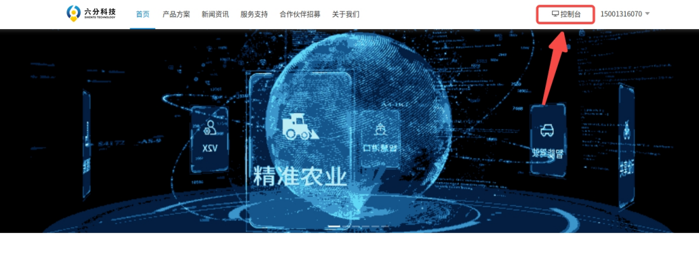

4.4 RTK Data
================

4.4.1 RTK Introduction
---------------------

The LK1220D is an industrial‑grade, full‑frequency, high‑precision positioning and orientation module developed by Sixents Technology. It supports up to 1040 satellite channels and dual‑antenna input. The module features built‑in high‑precision NRTK and orientation algorithms, along with excellent anti‑interference capabilities. With a baseband‑integrated multi‑frequency narrowband anti‑interference unit, it ensures robust signal reception and processing performance in complex electromagnetic environments.<br>
The D1 Max provides a reserved RTK expansion interface internally, with drivers pre‑installed. To use the RTK service, an external antenna (SMA connector) and an activated RTK service account are required. Additionally, the 4G module must have external network access for the RTK function to operate properly. Recommended RTK antenna model: Beitian BT560.

```
Positioning Accuracy:
Horizontal Positioning Accuracy: Single‑point positioning: 1.5m; Differential positioning: 2–3cm; RTK precision: 1cm + 1ppm;
Vertical Positioning Accuracy: Single‑point positioning: 2.5m; Differential positioning: 4–5cm; RTK precision: 1.5cm + 1ppm;
Note 1: Single‑point positioning requires an antenna; differential positioning requires an antenna and an activated RTK service account.
Note 2: RTK precision is measured under the following conditions: high‑precision antenna, open‑sky area, and within 1km of the base station.
```

4.4.2 Obtaining Sixents RTK Service
----------------------

Log in to the official Sixents website using the registered account and password
URL:<https://www.sixents.com/login>
- Log in to the console

- Obtain the AK and AS credentials


4.4.3 RTK Service Configuration on the NX Side
----------------------

- Log in to the NX<br>
First, connect to the robot's Wi‑Fi (default password: 12345678)

```
ssh robot@192.168.168.100   #password: 1
```

- Open the configuration file

Configuration file path: `sudo vim /ota/sixents_config.ini`

```
Configuration File Description
[sixents_sdk]
sdk_ak = 
sdk_as = 
sdk_dev_id = 
sdk_dev_type = 
```

  * sdk_ak: Set to the AK of your purchased service instance
  * sdk_as: Set to the AS of your purchased service instance
  * sdk_dev_id: Set your device ID or SN (customizable)
  * sdk_dev_type: Set your device type (customizable)

**Note: The sdk_dev_id and sdk_dev_type are uniquely bound to your account. Any subsequent changes require unbinding via the official website**

4.4.4 ROS2 Interface Definition
----------------------

- RTK Topic Name

RTK Topic Name: `/rtk_pvh`


- Data Description

| Category | Field | Description |
|------|------|------|
| heading | utc_time_s | Heading UTC time |
|         | sol_status | Solution status<br>0：Solved<br>1: Insufficient observations<br>2: Not converged<br>4: Trace of covariance matrix exceeds maximum (trace > 1000m) |
|         | heading_type | Positioning type<br>0: No solution computed<br>16: Single‑point positioning<br>17: Pseudorange differential positioning<br>34: Float solution<br>50: Fixed integer solution<br>pos_type = 50 indicates high-precision positioning |
|         | base_line | Baseline length (meters), range 0–3000 |
|         | heading_deg | Heading angle (degrees), range 0–360 |
|         | pitch_deg | Pitch angle (degrees), range ±90 |
|         | heading_std | Heading angle standard deviation (degrees) |
|         | pitch_std | Pitch angle standard deviation (degrees) |
|         | sys_num | Number of tracked satellites |
|         | soln_svs_num | Number of satellites used in solution |
| bestnav | utc_time_s | Bestpos UTC time |
|         | p_sol_status | Solution status |
|         | pos_type | Positioning type |
|         | latitude_deg | Latitude (degrees) |
|         | longitude_deg | Longitude (degrees) |
|         | altitude_m | Altitude (meters) |
|         | undulation | Geoid undulation — the difference between the geoid and the WGS84 reference ellipsoid (meters) |
|         | lat_std | Latitude standard deviation (meters) |
|         | lon_std | Longitude standard deviation (meters) |
|         | hgt_std | Height standard deviation (meters) |
|         | diff_age_s | Differential correction age (seconds) |
|         | sol_age_s | Solution age (seconds) |
|         | svs_num | Number of tracked satellites |
|         | soln_svs_num | Number of satellites used in solution |
|         | v_sol_status | Solution status  |
|         | vel_type | Positioning type |
|         | hor_spd | Horizontal ground speed (m/s) |
|         | trk_gnd | True ground track direction relative to true north (degrees) |
|         | ver_spd | Vertical velocity (m/s). positive = upward, negative = downward |
|         | ver_spd_std | Vertical velocity standard deviation (not filled) |
|         | hor_spd_std | Horizontal ground speed standard deviation (not filled) |

4.4.5 Retrieving RTK Data
-----------------------

```
ssh robot@192.168.168.100   
ros2 topic echo /rtk_pvh --once
```