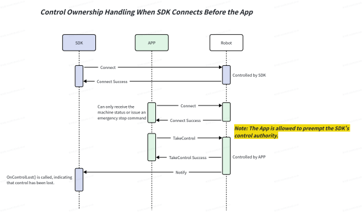
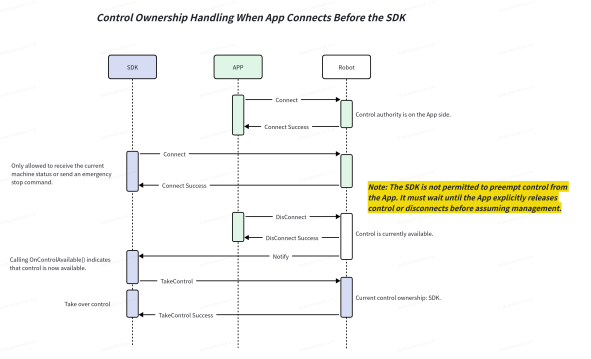

5.1 Control Authority Switching Instructions
=====================

**Function Overview:**
The control authority switching function is primarily used during SDK control phases to handle emergency situations or scenarios requiring manual intervention.

**Control Principles:**
- Simultaneous control by both the remote controller and the SDK is not supported.
- During the SDK control phase, the APP on the remote controller can preempt control authority and trigger a soft emergency stop from the remote controller.
- During the remote controller control phase, the SDK cannot acquire control authority, but it can still issue an emergency stop command via the SDK and retrieve device status.

SDK connects first, APP connects later

APP connects first, SDK connects later

