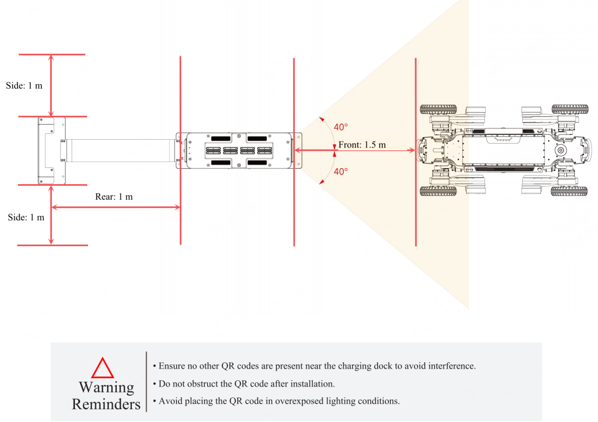

5.2 Autonomous Docking & Recharging Instructions
===================

**Version Requirements:**
RK3588 version: 0.2.4+; Orin NX firmware version: 0.4.5+

**Usage Requirements:**
A charging station is required. For installation instructions, refer to the "AGIBOT D1 Max Autonomous Charging Product Manual". Currently, the system supports mapless docking & recharging, which requires positioning the D1 Max robot directly facing the charging station with the robot's head approximately 1.5m away from the station, ensuring that the QR code on the charging station is fully visible within the camera's field of view.



**Demo Execution:**

```
# Enter the C++ demo directory
cd example

# Create a build directory
mkdir build && cd build

# Configure and build the project
cmake ..
make -j6

# Run the demo executable
./control 192.168.168.168 8081 192.168.168.100 10010
```