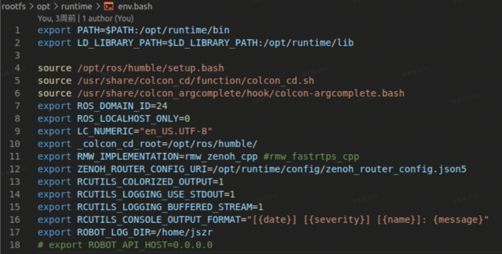
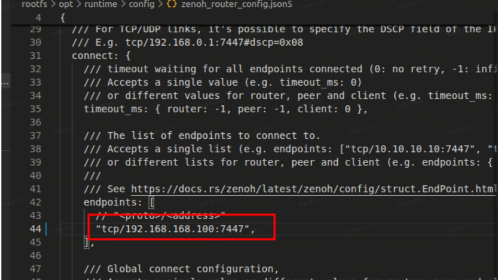

5.3 ROS2 Multi‑Machine Communication Configuration
=====================

The NX system provides a unified environment configuration file: `/opt/runtime/env.bash`. This file is automatically sourced in `.bashrc`



As shown above, `ROS_DOMAIN_ID=24`. The robot currently uses the ROS2 Zenoh middleware to provide ROS2 topic services externally. Users are required to install the corresponding environment on their own laptops.

- IP Configuration<br>
Set the user laptop IP to: 192.168.168.xxx (xxx cannot be 100, 168, or 255)
-  User Laptop Environment Configuration
    * Ubuntu22.04
    * Ros2 humble
    * Zenoh rmw
- Install Zenoh
```
sudo apt-get install ros-humble-rmw-zenoh-cpp
```
- Modify the Configuration File<br>
Open the following file with an editor`/opt/ros/humble/share/rmw_zenoh_cpp/config/DEFAULT_RMW_ZENOH_ROUTER_CONFIG.json5`Locate the `connect/endpoints` field and add the robot NX's IP address: `"tcp/192.168.168.100:7447"`



On the PC, open a new terminal 1 and set the middleware environment variables and ROS2 Domain ID
```
source /opt/ros/humble/setup.bash
export ROS_DOMAIN_ID=24
export RMW_IMPLEMENTATION=rmw_zenoh_cpp
ros2 run rmw_zenoh_cpp rmw_zenohd
```
Reset the ROS2 daemon
```
ros2 daemon stop
ros2 daemon start
```
With the above environment variables set, you can use RViz for visualization, record bag files, or launch your own ROS2 programs to interact with the robot's drivers.