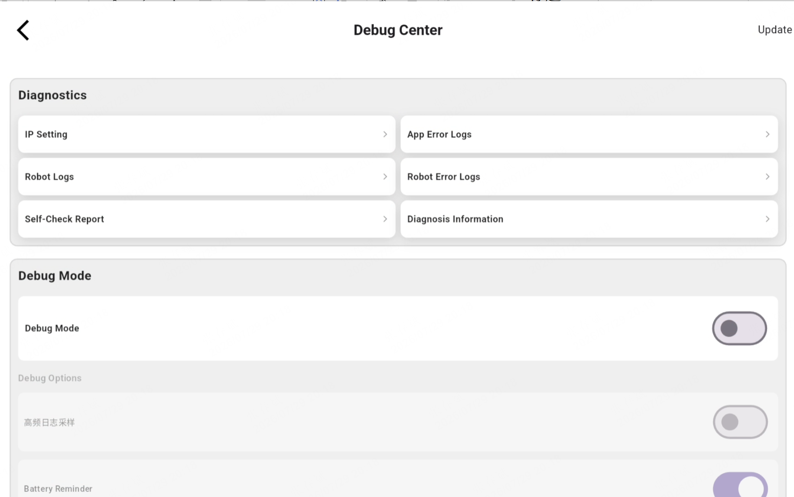
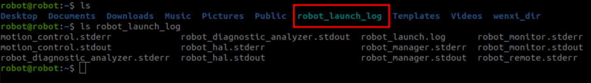

5.4 Log Viewing
======================

- **Viewing Remote Controller Error Messages**<br>
Continuously click the bottom-left corner of the homepage


Open the Settings Center to view the device exception logs



- **Viewing Device Logs**<br>
Log path for the most recent device startup (RK & NX):`/home/robot/robot_launch_log`<br>
Log path for the most recent 6 device startups (RK & NX):`/userdata/log/`<br>
Log path for autonomous docking & recharging (NX):`/tmp/log/alg_data`

```
scp -r robot@192.168.234.1:/userdata/log.  # Pull logs from the most recent 6 device startups
scp -r robot@192.168.234.1:/home/robot/robot_launch_log .  # Pull logs from the current device startup
```

