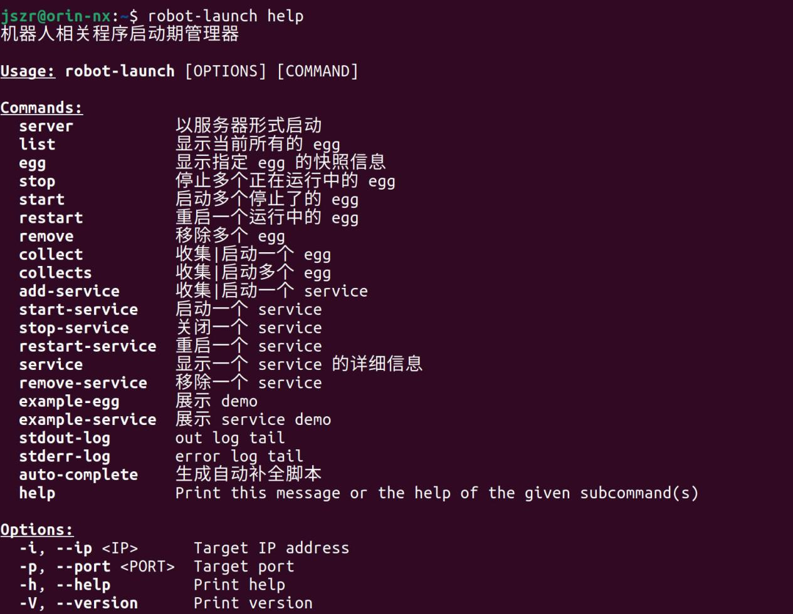

5.5 Device Process Utility Usage
======================

**Usage Instructions:**
The robot-launch tool is used on the device to manage related processes, including viewing process status, starting and stopping processes, and viewing process logs.
**Format Description:**
robot-launch [OPTIONS] [COMMAND]



```
Examples:
Stop a node: robot-launch stop <# id>
Start a node: robot-launch start <# id>
View node status: robot-launch egg <# id>
View help information: robot-launch help
...
```